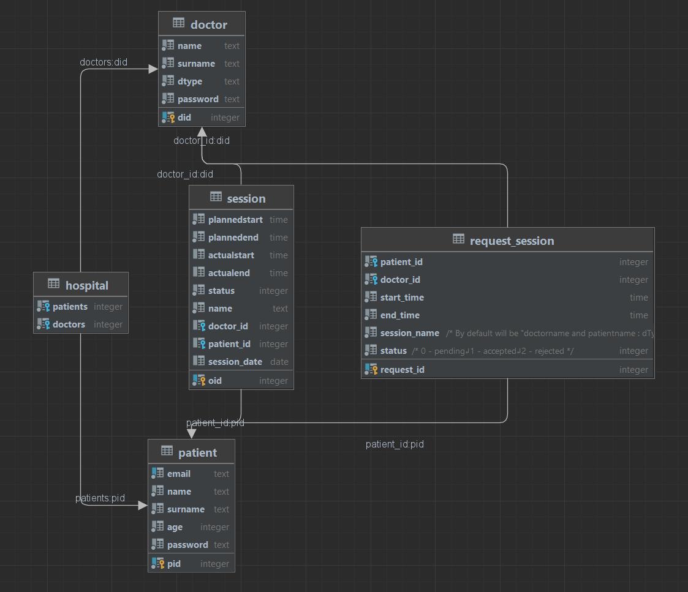

# Hospital System
## FIT CTU BIE-TJV 2022 semester project,
### by Nikita Matsnev

## 1.  Description
#### 1.1. Domain
This is a project for BIE-TJV implemented by Nikita Matsnev in 2022 winter semester.
The domain is hospital where Patients with known email(unique), name and surname can have
Session at some specific time
and there is a Doctor at each session, and we know about him/her his/her name, surname and
specialization. we can determine actual time of Session after it is done, and we track it by its status
and each patient has a medical records book where all the performed sessions are seen and also the information
about receiving doctor. Doctor can see finished and upcoming Sessions. They can create Session slots.
There are several constraints such as Doctor cannot be at two Sessions at the same or overlapping time.
Patient cannot attend several Sessions at the same or overlapping time.
Patient can have many sessions with many doctors and doctors can have many sessions with different patients.
Patients and Doctors are assigned to the hospital. Doctors can treat patients within the hospital.

### 1.2. Complex queries
#### 1.2.1. JPA JPQL
##### 1.2.1.1. Patients of hospital can see their doctors
I use relations of patients to their sessions to retrieve information about doctors.
##### 1.2.1.2. Doctors of hospital can see available patients
I use relations of doctors and patients to hospital to get the list of available patients, and that will connect two tables
##### 1.2.1.3. Select doctors based on their type
I will create an ability for patients to request sessions with the available doctors at the specific time based on the requested specialization using JPQL.

### 1.3. Complex business processes
#### 1.3.1. Provide fun statistics
Show the doctor with the biggest amount of unique visitors;
Show the doctor with the biggest amount of sessions;
Show the patient with the biggest variety of doctors with regard to their specialization.
#### 1.3.2. Handle the end of the session
Once the session is finished, its status must be changed, as well as the actual start and end times will be updated. Also doctor and patient entities have increase by 1 in the number of operations.
#### 1.4.2 Patient leaves the hospital to another
Patient's log will be transferred to another hospital, his upcoming sessions shall be terminated, doctors will not have this user in available patients anymore, patient cannot choose previous doctors to request appointment anymore.

### 1.4. Server
Server will be implemented in Java Spring. I wil use `jdk18` and `Java 17`. Spring Web will be used
to provide RestAPI.

#### API Endpoints:
##### 1. Patients:
`GET /patients/{id}` - gets patient by id \
`PUT /patients/{id}` - updates patient with id \
`DELETE /patients/{id}` - deletes patient with id \
`POST /patients/register` - registers patient with id and given body \
`POST /patients/login` - check if patient with email exists and password matches
##### 2. Doctors:
`GET /doctors/{id}` - gets doctor by id \
`PUT /doctors/{id}` - updates doctor with id \
`DELETE /doctors/{id}` - deletes doctor with id \
`POST /doctors/register` - registers doctor with id and given body \
`POST /doctors/login` - check if doctor with email exists and password matches
##### 3. Sessions:
`GET /session/{id}` - gets session by id \
`PUT /session/{id}` - updates session with id \
`DELETE /session/{id}` - deletes session with id \
`POST /session/create` - creates session with id and given body \
`GET /session/doctor/{id}` - gets this doctor sessions \
`GET /session/patient/{id}` - gets this patient sessions \
`GET /session/name/{doctor}/{name}` - gets session with this doctor and name \
`POST /session/name/{doctor}/{name}` - updates session with this doctor and name
### 1.5. Web client
I am planning on using the Reactive Stack and Spring WebFlux, and I use it. I also use Thymeleaf for templating. And Seneca's letters for contemplating:D.

### 1.6. Database
PostgresSQL will be used, I have already created a schema. It has two many-to-many relations.

## 2. Build
* [Official Gradle documentation](https://docs.gradle.org)
## 3. Run
* [Official Gradle documentation](https://docs.gradle.org)
## 4. Test
junit tests
